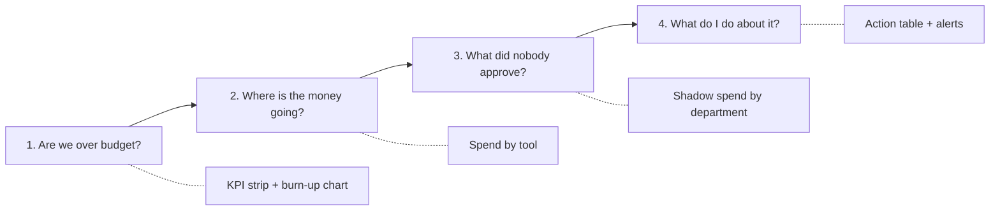

# Part 1 - The Screen: AI Governance Dashboard

> One screen. Annotated spec plus wireframe. Written so it converts directly into build tickets.

---

## 1. Who this is for, and what they are trying to do

**Primary persona: Priya, CFO of a 1,200-person B2B SaaS company.**
She is not trying to understand AI. She is trying to avoid a surprise. Last quarter, AI line items appeared in three different cost centres, none of them budgeted, and she found out at month-end close. She has now set a $120K monthly ceiling on AI spend and needs to know whether it is going to hold.

**Secondary persona: Dan, Head of IT/Security.**
He needs the same underlying data but a different cut of it: which tools have no DPA, which are outside SSO, which departments are using something nobody reviewed. He is the one who acts on the findings; Priya is the one who asks for them.

**Explicitly not the persona:** the individual engineer optimising their token spend. That is a developer-tooling problem, and designing for it would pull the screen towards per-model token charts that neither Priya nor Dan can act on.

### The job-to-be-done, in the user's words

> "Before month-end, tell me whether our AI spend is going to breach the limit I set, where the money is going, and how much of it nobody approved - in language I can forward to the board without editing."

That sentence produces four questions, and the screen answers them in this order because that is the order they get asked:



**Design principle that follows from this:** the screen is read top-to-bottom as a narrative, not scanned as a grid of equally-weighted widgets. Vertical position encodes priority.

---

## 2. Wireframe

Low fidelity on purpose. Numbered callouts are specified in section 3.

```
┌───────────────────────────────────────────────────────────────────────────────────────────────┐
│  AI Governance                     [ August 2026 ▾ ] [ All departments ▾ ] [ Export ▾ ]   (1) │
│  Acme Corp · 1,240 employees                                                                  │
│  ● Data as of 14 Aug, 06:00 IST   ◐ Coverage: 6 of 9 sources connected · 2 known gaps ⓘ   (2) │
├───────────────────────────────────────────────────────────────────────────────────────────────┤
│                                                                                               │
│  You have used 78% of the August AI budget with 12 days left, and are                     (3) │
│  tracking to finish $14.2K over the $120K limit.                                              │
│  Biggest movers: Midjourney (+$3.1K vs July) and 4 newly discovered tools.                    │
│                                                                                               │
├──────────────┬──────────────┬──────────────┬──────────────┬──────────────────────────────────┤
│ MTD SPEND    │ FORECAST EOM │ TOOLS IN USE │ SEAT USAGE   │ POLICY FLAGS                 (4) │
│ $93.6K       │ $134.2K      │ 27           │ 1,412/1,890  │ 9 open                           │
│ of $120K     │ ▲$14.2K over │ 18 sanctioned│ 478 idle     │ 3 high · 6 medium                │
│ [███████░░]  │              │  9 shadow    │ = $11.4K/mo  │                                  │
│ 78%          │              │              │   recoverable│                                  │
│ ● metered    │ ◐ estimated  │ ◔ inferred   │ ● metered    │ ● metered                        │
├──────────────┴──────────────┴──────────────┴──────────────┴──────────────────────────────────┤
│                                                                                               │
│  CHART 1 - Are we going to breach?              CHART 2 - Where is it going?              (5) │
│  ┌─────────────────────────────────────┐        ┌──────────────────────────────────────────┐  │
│  │ Spend vs limit, Aug to date         │        │ Spend by tool, top 10                    │  │
│  │ $120K ─ ─ ─ ─ ─ ─ ─ ─ ─ ─ ─ ─╱▒▒▒│        │ GitHub Copilot  ████████████▌│ $22.4K    │  │
│  │  limit              ╱───────╱ ▒▒▒▒│        │ OpenAI API      ██████████▌ ⋮  $19.1K    │  │
│  │                  ╱╱  forecast ▒▒▒▒│        │ M365 Copilot    ████████⋮      $14.8K    │  │
│  │            ╱────╱   overage $14.2K │        │ Claude Team     ██████⋮        $11.2K    │  │
│  │      ╱────╱  actual                │        │ Midjourney ⚠    █████▌⋮        $ 9.7K    │  │
│  │ ╱───╱                              │        │ Cursor          ████⋮          $ 7.4K    │  │
│  │ 1    5    10   15   20   25   31   │        │ Perplexity ⚠    ███⋮           $ 5.1K    │  │
│  └─────────────────────────────────────┘        │ ⋮ = tool limit    ⚠ = shadow / unapproved│  │
│  "On current pace, August closes 12%             └──────────────────────────────────────────┘  │
│   over the limit."                               "3 of the top 10 tools are over their limit." │
│                                                                                               │
│  CHART 3 - Who do I call?                                                                 (6) │
│  ┌─────────────────────────────────────────────────────────────────────────────────────────┐  │
│  │ Sanctioned / Pending review / Shadow spend by department (sorted by shadow $)           │  │
│  │ Engineering  ████████████████████░░░░▓▓▓▓        $38.2K   ▓ shadow $4.1K                │  │
│  │ Marketing    ██████████░░░░░░▓▓▓▓▓▓▓▓            $21.4K   ▓ shadow $6.8K  ← worst       │  │
│  │ Design       ████████░░▓▓▓▓                      $12.1K   ▓ shadow $2.2K                │  │
│  │ Sales        ███████▓▓                           $ 9.8K   ▓ shadow $1.1K                │  │
│  │ Support      █████░░                             $ 6.2K                                 │  │
│  │ Unattributed ███▓▓▓▓▓                            $ 5.9K   ⚠ cannot allocate - see note  │  │
│  │              █ sanctioned   ░ pending review   ▓ shadow                                 │  │
│  └─────────────────────────────────────────────────────────────────────────────────────────┘  │
│  "Marketing has $6.8K of unapproved AI spend this month, the highest of any department."       │
│                                                                                               │
├───────────────────────────────────────────────────────────────────────────────────────────────┤
│  TOOLS NEEDING ATTENTION                            [ All ][ Shadow ][ Over limit ][ Risk ](7)│
│ ┌───────────────────────────────────────────────────────────────────────────────────────────┐ │
│ │ Tool        Owner      Dept      Users  MTD     Limit   %     Status   Risk   Action      │ │
│ │ Midjourney  (none)     Marketing   14   $9.7K   $4.0K  242%🔴 Shadow  ⚠DPA  [Approve][…] │ │
│ │ Perplexity  (none)     Marketing   31   $5.1K    none   n/a   Shadow  ⚠SSO  [Set limit]  │ │
│ │ OpenAI API  R. Mehta   Eng         88  $19.1K  $18.0K  106%🟠 OK       -     [Raise cap]  │ │
│ │ Copilot     A. Iyer    Eng        420  $22.4K  $25.0K   90%🟡 OK       -     [Review]     │ │
│ │ Claude Team S. Rao     Product      62 $11.2K  $12.0K   93%🟡 OK       -     [Review]     │ │
│ │ Notion AI   (none)     Support      9   $0.4K   none    n/a  Pending   -     [Approve]    │ │
│ └───────────────────────────────────────────────────────────────────────────────────────────┘ │
│                                                          Showing 6 of 27 · [ View all tools ] │
└───────────────────────────────────────────────────────────────────────────────────────────────┘

  ┌─ ALERTS (right rail, collapsible) ────────────────────┐
  │ 🔴 Midjourney is 242% of its limit          2h ago (8)│
  │ 🟠 New tool discovered: Gamma AI (6 users)   1d ago   │
  │ 🟠 OpenAI API spend +38% week over week      1d ago   │
  │ 🟡 Claude Team renews in 21 days · 41% idle  3d ago   │
  │ ⚪ Zscaler connector failed to sync          4h ago   │
  └───────────────────────────────────────────────────────┘
```

---

## 3. Annotations

### (1) Control bar

Month selector defaults to the current month, because the job-to-be-done is forward-looking. Department filter re-scopes every element on the page including the limit line. Export produces a one-page PDF and a scheduled email digest - a CFO forwards things, so export is a first-class feature, not a footer link.

### (2) Freshness and coverage badge

**This is the most important element on the screen and the one most products omit.** It shows two things:

- **Data as of** - the oldest timestamp among the sources feeding this view, not the newest. Reporting the newest is flattering and dishonest.
- **Coverage** - how many configured sources are connected and healthy, and how many known gaps exist. Clicking it opens a panel listing exactly what is not visible: *"Personal-card subscriptions are not visible because no expense platform is connected"*, *"Zscaler sync failed 4h ago"*.

Rationale: the failure mode for a governance dashboard is not being wrong, it is being confidently wrong. A CFO who discovers an uncounted $30K invoice will never trust the tool again. A CFO who was told up front that personal-card spend is invisible will trust it more, not less, and will go fix the gap. Honest coverage converts a reporting weakness into a product-led expansion prompt.

### (3) Plain-language headline

Auto-generated, one to two sentences, always structured as **position → time remaining → consequence in dollars**. Dollars before percentages, because "$14.2K over" survives a forward to the board and "117% of limit" does not. The second line names the biggest movers so the reader has a subject to ask about.

This is deliberately the largest text on the page. If a non-technical stakeholder reads only one element, this is the one that has to work.

### (4) KPI strip

Five tiles, each with a confidence marker (`● metered` / `◐ estimated` / `◔ inferred`, defined in [Part 2](part2-data-sources.md#confidence-tiers)).

- **MTD spend vs limit** - the anchor number, with a progress bar.
- **Forecast EOM** - run-rate projection and the projected overage in dollars. Marked `estimated` because it is a projection; hovering shows the method (trailing 7-day average, seasonality-naive in v1).
- **Tools in use** - split sanctioned vs. shadow. The split is the whole point; a single count of 27 is trivia.
- **Seat usage** - paid seats against seats with activity in the last 30 days, expressed as recoverable dollars per month. This is the tile that pays for the product, and it is the one that makes finance forgive everything else.
- **Policy flags** - open governance issues by severity, owned by Dan rather than Priya, which is why it sits at the far right of the strip.

### (5) and (6) The three charts

Full rationale in [Part 3](part3-charts.md). Two things to note about how they appear on this screen:

- Each chart carries a generated **takeaway sentence** underneath it. Charts are a compression format for people who read charts; the sentence is for everyone else. This costs almost nothing to build and is the single highest-leverage accessibility decision on the screen.
- Chart 3 includes an explicit **Unattributed** row. When identity resolution fails, the dollars go into a visible bucket rather than being silently dropped or guessed into a department. Hiding unattributed spend to make a chart look clean is how these products lose trust.

### (7) Action table - "Tools needing attention"

This is what makes the screen a workflow rather than a report, and it is the part I would defend hardest in a scoping review.

- Default sort is by severity, not alphabetically or by spend: over-limit shadow tools first.
- **Owner** is a column with visible `(none)` values. An unowned tool is itself a finding, and the empty cell is a call to action.
- **Status** is a defined lifecycle: `Sanctioned → Pending review → Shadow → Blocked`. Every tool sits in exactly one state, and a state transition is the unit of work this product creates.
- **Risk badges** are limited to three that a CFO can understand without a security briefing: no DPA in place, vendor trains on submitted data, not behind SSO.
- **Row actions** write back: approve the tool, set or raise a limit, request an owner review (creates a ticket and emails the department head), block. In v1, "block" creates a request for the IdP or network admin rather than executing directly - see scope cuts.

### (8) Alerts rail

Four alert types only, because an alert product with twenty types is a mute button waiting to happen: limit breach, new tool discovered, anomalous week-over-week spike, and renewal approaching with low utilisation. Collapsible, and the last item deliberately shows **connector health** in the same feed as business alerts, so a silent data gap is as visible as a spend problem.

---

## 4. Defining "limit" precisely

Ambiguity here would sink the build, so the spec pins it down:

- **Scope** - a limit can be set at organisation, department, or tool level. Tool-level limits roll up but do not have to sum to the org limit; the org limit is a ceiling, not an allocation. Where they conflict, the tightest applicable limit governs the alert.
- **Type** - a limit is either a **soft threshold** (alert at 80% and 100%, no enforcement) or a **hard cap** (alert plus an enforcement request). v1 supports both as *definitions* but only soft behaviour as *enforcement*.
- **Period** - calendar month, aligned to the finance close, not a rolling 30 days. Finance thinks in months; a rolling window produces numbers that never reconcile to the general ledger.
- **Basis** - limits are measured against `metered` and `estimated` spend combined, and the tile discloses how much of the figure is estimated. Excluding estimates would understate reality; hiding the mix would overstate confidence.
- **What a limit is not** - it is not a technical rate limit. Where a vendor supports a real spend cap (for example OpenAI's organisation spend limit endpoint, see [Part 2](part2-data-sources.md)), the UI shows the vendor-side cap as a separate, clearly-labelled field, because that one actually stops traffic and ours does not.

---

## 5. States

| State | Trigger | Design response |
| --- | --- | --- |
| **Empty** | No sources connected | Do not show a zeroed dashboard. Show a three-step setup and a **CSV / invoice upload** path that produces a real chart in under ten minutes. First value must not depend on IT scheduling an integration. |
| **Partial coverage** | Some sources connected | Render normally, but the coverage badge goes amber and the panel names each gap. Never imply completeness. |
| **Estimate-heavy** | Over 40% of MTD spend is `estimated` | Banner: "62% of this month's figure is estimated from usage rather than invoices. Connect an expense platform to firm this up." Turns a data weakness into a next action. |
| **Loading** | Query in flight | Skeletons that preserve layout, and stale-while-revalidate showing the previous value with a dimmed timestamp. Never an empty screen for a returning user. |
| **Limit breached** | MTD or forecast exceeds limit | Headline and the breached tile go red, an alert is pinned, and the action table auto-filters to the contributing tools. The screen re-composes itself around the problem instead of leaving the reader to find it. |
| **Connector failed** | Sync error over 24h | Amber row in the alerts rail plus a per-tile asterisk on any figure the failed source feeds. Degradation is disclosed at the point of use, not only in a settings page. |

---

## 6. Explicitly out of scope for v1

Naming the cuts and the reason is the point of this section.

- **Prompt and content inspection / DLP.** Cut because it converts a finance tool into a surveillance tool, requires GDPR and works-council review in EU-headquartered customers, and materially raises the security bar for our own storage. The buying question is "what are we spending and did we approve it", not "what did Ravi type". A future DLP module should be sold to a different buyer with different consent.
- **Automated blocking and enforcement.** Cut because a false positive that blocks a paying team's tooling is an unrecoverable trust event in month one. v1 generates enforcement *requests* into the IdP or network owner's queue. Enforcement earns its way in after we can show a low false-positive rate on detection.
- **Per-prompt or per-request cost attribution.** Cut for v1 unless the customer already routes traffic through an AI gateway, in which case we read it for free. Building it ourselves means becoming a proxy in the critical path of production traffic, which is a different product with a different risk profile.
- **Chargeback and internal invoicing.** Cut because it requires GL-grade accuracy and finance sign-off on allocation rules. v1 shows allocation for *visibility*; posting journal entries is a fast-follow once attribution accuracy is proven above roughly 95%.
- **Productivity and ROI measurement.** Cut because it is not credibly measurable in v1 and attempting it invites the argument "prove Copilot made us faster", which we would lose. Better to be excellent at the cost and governance side than mediocre at both.
- **Model-level quality, safety scoring and evals.** Different buyer (ML platform lead), different product.

---

## 7. Success metrics

**North star: percentage of total AI spend under management.**
Defined as spend visible in the product divided by best-known total AI spend, including reconciliation against the general ledger during onboarding. Chosen deliberately over engagement metrics: a governance product that is opened daily but sees 40% of spend is failing, and a product opened weekly that sees 98% is winning. It also measures the thing that is genuinely hard, which is coverage.

**Supporting metrics**

- **Time to first insight** - account creation to first populated chart. Target under 30 minutes via the CSV path.
- **Shadow resolution rate** - share of newly discovered tools moved to `Sanctioned` or `Blocked` within 30 days. Measures whether the workflow works, not just whether the detection does.
- **Recovered spend** - dollars from cancelled idle seats and enforced limits, attributed in-product. This is the number that renews the contract.
- **Alert-to-action rate** - share of alerts followed by a state change within seven days. If this falls, the alerts are noise.
- **Limit coverage** - share of active tools that have a limit set at all. An early leading indicator of habit formation.

**Guardrail: false-positive rate on shadow detection.**
Tracked from the `Approve` versus `Block` outcomes on discovered tools, with an explicit "not a real finding" dismissal reason. If precision drops below roughly 85%, the discovery pipeline gets tuned before any new sources are added. A noisy governance dashboard is not a mildly worse dashboard; it is an ignored one, and ignored dashboards do not renew.
