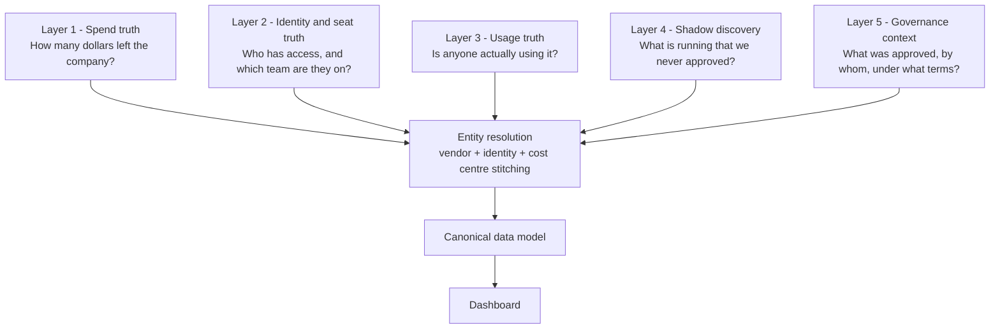
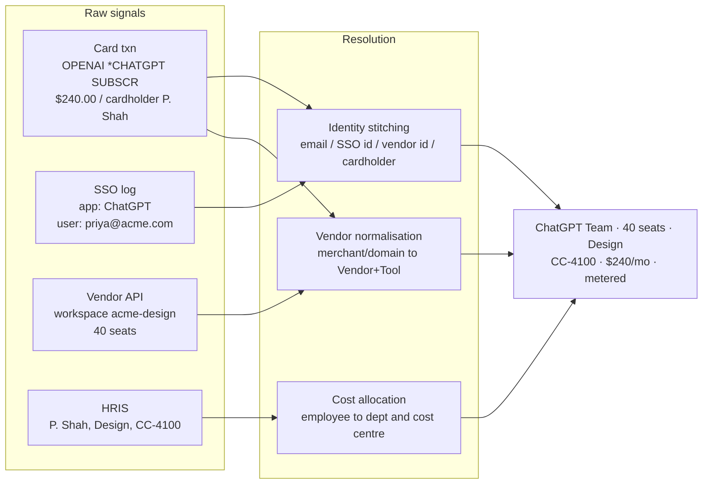
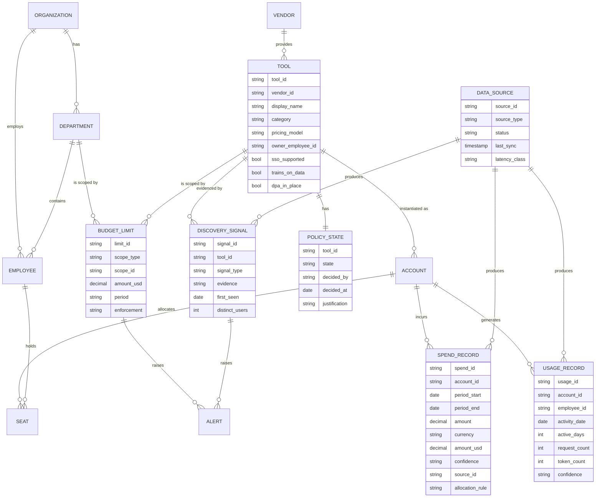

# Part 2 - API and Data Source Plan

> Every source below is cited with its documentation link. Endpoint paths were checked against current public docs in August 2026; vendor APIs move, so the plan treats every path as verify-at-build-time rather than as a contract.

---

## The organising idea

The naive version of this answer is a list of logos. That list is not a plan, because it does not say what each source is *for*, and it hides the fact that different sources disagree with each other.

So the plan is organised into **five layers, by the question each layer answers**:

Two rules run through all five layers:

1. **Only Layer 1 can assert a dollar as fact.** Everything else either estimates dollars or contributes no dollars at all. Conflating these is how governance dashboards end up unable to reconcile to the general ledger.
2. **Layer 2 is the join key for the entire product.** Without identity and HRIS, there is no "by department" view, no owner column, and no meaningful shadow attribution. It is not glamorous and it is the first integration I would build.

---

## Layer 1 - Spend truth

The only sources that can state a dollar figure as fact. These are the system of record.

### 1a. Card, expense and AP platforms

The single most valuable category, because it is the only place a **personal-card or team-card AI subscription** ever becomes visible. This is where most true shadow AI spend hides.

| Source | What it gives us | Docs |
| --- | --- | --- |
| Ramp | Card transactions with `merchant_name`, `merchant_descriptor`, MCC, cardholder `user_id`, department/location, memo | [docs.ramp.com](https://docs.ramp.com/) |
| Brex | `GET /v2/transactions/card/primary`, card accounts, statements | [developer.brex.com](https://developer.brex.com/openapi/transactions_api) |
| Xero | Invoices, bills, contacts for AP-side AI vendors | [developer.xero.com](https://developer.xero.com/documentation/api/accounting/overview) |
| QuickBooks Online | Purchases, vendors, expense lines | [developer.intuit.com](https://developer.intuit.com/app/developer/qbo/docs/api/accounting/most-commonly-used/purchase) |
| NetSuite / Coupa / Bill.com | Enterprise AP, PO and vendor master for larger customers | [developer.oracle.com/netsuite](https://developer.oracle.com/netsuite/) |

**Why this matters more than the vendor APIs:** a vendor admin API can only tell you about accounts you already know exist. Card data tells you about the ones you do not. A `$20.00 / OPENAI *CHATGPT SUBSCR` line on a marketing manager's card is a shadow-AI detection with a dollar figure attached, which is the most actionable signal in the entire system.

### 1b. AI provider billing and usage APIs

These give metered, authoritative cost for the accounts the company knows about.

| Provider | Endpoint / capability | Docs |
| --- | --- | --- |
| OpenAI | `GET /v1/organization/costs` (group by `project_id`, `line_item`, `api_key_id`) and `GET /v1/organization/usage/completions` (group by model, project, user, API key). Requires an **Admin API key**, org-owner only, and can be scoped read-only. Also exposes `POST /v1/organization/spend_limit` - a real vendor-side hard cap | [Admin APIs guide](https://developers.openai.com/api/docs/guides/admin-apis) · [Costs reference](https://developers.openai.com/api/reference/resources/admin/subresources/organization/subresources/usage/methods/costs/) · [cookbook](https://developers.openai.com/cookbook/examples/completions_usage_api) |
| Anthropic | `GET /v1/organizations/cost_report` (USD, daily buckets) and `GET /v1/organizations/usage_report/messages` (token-level, 1m/1h/1d buckets), plus `claude_code` usage. Requires an Admin key (`sk-ant-admin…`); **unavailable for individual accounts** | [Usage and Cost API](https://platform.claude.com/docs/en/manage-claude/usage-cost-api) · [Admin API](https://platform.claude.com/docs/en/manage-claude/admin-api) · [Spend limits](https://platform.claude.com/docs/en/manage-claude/spend-limits-api) |
| GitHub Copilot | `GET /organizations/{org}/settings/billing/usage` and `/usage/summary` for billed usage including premium requests and AI credits; enterprise-level equivalents exist | [Billing usage REST](https://docs.github.com/en/rest/billing/usage) |
| Azure OpenAI | Cost Management Query API against the subscription/resource-group scope | [Cost Management query](https://learn.microsoft.com/en-us/rest/api/cost-management/query/usage) |
| Google Vertex / Gemini | Cloud Billing export to BigQuery (standard, detailed, or FOCUS-normalised), then query by SKU | [Billing export to BigQuery](https://cloud.google.com/billing/docs/how-to/export-data-bigquery) |
| AWS Bedrock | Data Exports / CUR 2.0 to S3 for line-item detail; Cost Explorer `GetCostAndUsage` for aggregates | [AWS Data Exports](https://docs.aws.amazon.com/cur/latest/userguide/what-is-data-exports.html) · [GetCostAndUsage](https://docs.aws.amazon.com/aws-cost-management/latest/APIReference/API_GetCostAndUsage.html) |

Two product notes worth surfacing to a stakeholder:

- **Anthropic's Priority Tier spend never appears in the cost endpoint** ([documented gotcha](https://platform.claude.com/cookbook/observability-usage-cost-api)). We must reconcile it from the usage endpoint and label it `estimated`. This is a concrete, checkable example of why the confidence tier is a product requirement and not decoration.
- **Where the vendor supports a real hard cap** (OpenAI and Anthropic both do), we surface it as a distinct, clearly-labelled field. Our limits alert; theirs actually returns a `429`. Blurring the two would be dishonest about what the product controls.

### 1c. Invoice and email ingestion (the catch-all)

A forwarding address plus PDF parsing for the long tail: annual invoices, resellers, marketplace bundles, and the many AI tools with no admin API at all. Unglamorous, and the only thing that gets coverage from roughly 85% to the high nineties.

---

## Layer 2 - Identity and seat truth

This layer answers "who" and "which team", and it is the join key for the whole product.

| Source | What it gives us | Docs |
| --- | --- | --- |
| Okta | System Log (`GET /api/v1/logs`, scope `okta.logs.read`) for `user.authentication.sso`, `application.user_membership.add/remove`, and `app.oauth2.*.consent.grant`; Apps API for assignments | [System Log query](https://developer.okta.com/docs/reference/system-log-query/) · [Event types](https://developer.okta.com/docs/reference/api/event-types/) · [List log events](https://developer.okta.com/docs/api/openapi/okta-management/management/tags/systemlog/other/listlogevents) |
| Microsoft Entra ID | `GET /v1.0/auditLogs/signIns` for sign-in history; `GET /v1.0/oauth2PermissionGrants` (plus `/delta`) for delegated consent grants | [signIn list](https://learn.microsoft.com/en-us/graph/api/signin-list?view=graph-rest-1.0) · [oauth2PermissionGrants](https://learn.microsoft.com/en-us/graph/api/oauth2permissiongrant-list?view=graph-rest-1.0) |
| Google Workspace | Reports API `activities.list` with `applicationName=token` for third-party OAuth grants; Directory API for users, orgunits and groups | [activities.list](https://developers.google.com/workspace/admin/reports/reference/rest/v1/activities/list) · [token activity events](https://developers.google.com/workspace/admin/reports/v1/appendix/activity/token) |
| HRIS - Workday, HiBob, BambooHR | Department, cost centre, manager, location, employment status, start/end dates | [developer.workday.com](https://developer.workday.com/) |
| HRIS aggregators - Merge, Finch | One integration instead of fifteen for the HRIS long tail | [docs.merge.dev](https://docs.merge.dev/hris/overview/) · [developer.tryfinch.com](https://developer.tryfinch.com/) |

**Two points I would make explicitly in a scoping review:**

1. **SSO sign-in logs are the most under-used discovery source in this entire problem space.** Every time an employee signs into an AI tool with "Continue with Google" or "Continue with Okta", the identity provider records it. That is a free, already-collected, org-wide inventory of which AI tools are in use by whom, and it requires no new agent, no network change and no vendor cooperation. It has one blind spot, which is tools signed up for with an email-and-password combination outside SSO - and that blind spot is precisely why Layer 4 exists.

2. **OAuth consent grants are simultaneously a spend signal and a data-exfiltration signal.** When an employee grants an unknown AI note-taker read access to their entire Google Drive or calendar, that is both a shadow tool and a security incident, and it typically costs the company nothing - so it is invisible to any finance-only approach. Both Okta and Entra expose these events. Surfacing them is how the IT/security persona gets value from a dashboard built for the CFO.

**Termination handling:** HRIS gives us leavers, and leavers with still-active AI seats are both a security exposure and pure waste. This is the highest-value cross-layer join in the product and it comes almost free once Layers 1 and 2 are in.

---

## Layer 3 - Usage truth

Spend tells you what you paid. Usage tells you whether it was worth paying. The gap between them is the recoverable money.

| Source | What it gives us | Docs |
| --- | --- | --- |
| GitHub Copilot | Daily and 28-day usage metrics reports, including per-user (`users-1-day`) and per-repo NDJSON reports; requires the Copilot usage metrics policy to be enabled | [Copilot usage metrics](https://docs.github.com/rest/copilot/copilot-usage-metrics) · [team-level metrics](https://docs.github.com/en/copilot/reference/copilot-usage-metrics/team-level-metrics) |
| Microsoft 365 Copilot | `GET /v1.0/copilot/reports/getMicrosoft365CopilotUsageUserDetail(period, version)`; `v2` adds prompt counts and active usage days. Scope `Reports.Read.All`. **Only returns users who hold a licence** | [Graph Copilot usage report](https://learn.microsoft.com/en-us/microsoft-365/copilot/extensibility/api/admin-settings/reports/copilotreportroot-getmicrosoft365copilotusageuserdetail) |
| Gemini in Google Workspace | Reports API with `applicationName=gemini_in_workspace_apps`; events carry `app_name`, `event_category` (active vs. inactive use), `feature_source` | [Gemini activity events](https://developers.google.com/workspace/admin/reports/v1/appendix/activity/gemini-in-workspace-apps) |
| Slack | `admin.analytics.getFile` for member and channel analytics on Enterprise Grid | [api.slack.com](https://api.slack.com/methods/admin.analytics.getFile) |
| Notion, Figma and similar | Member lists and workspace analytics where exposed | [developers.notion.com](https://developers.notion.com/) · [figma.com/developers](https://www.figma.com/developers/api) |

### The high-fidelity option: an AI gateway

If the customer routes LLM API traffic through a gateway, we get per-user, per-model, per-request cost for free - which is strictly better than anything the provider billing APIs offer.

| Gateway | Relevance | Docs |
| --- | --- | --- |
| Cloudflare AI Gateway | Logs every request with token counts and computed cost; behind Cloudflare Access it attaches a verified identity (`cf.user_id`) to each request, and supports dollar-denominated spend limits and per-user budgets | [User Insights](https://developers.cloudflare.com/ai-gateway/observability/user-insights/) · [spend limits](https://blog.cloudflare.com/ai-gateway-spend-limits/) |
| LiteLLM | Per-key, per-user and per-team spend via `/user/info`, `/global/spend/report`, `/spend/logs` | [Spend tracking](https://docs.litellm.ai/docs/proxy/cost_tracking) |
| Portkey | Similar proxy-level cost and metadata capture | [portkey.ai/docs](https://portkey.ai/docs/) |

**Product position:** recommend a gateway to API-heavy customers, integrate as a reader, and do **not** build our own proxy in v1. Sitting in the critical path of a customer's production AI traffic is a different product with a different reliability and liability profile, and it would gate our sales cycle on a security review of our uptime.

---

## Layer 4 - Shadow discovery

Finding what nobody told us about. This layer usually produces **signals without dollars**, which is exactly why the confidence model exists.

| Source | What it gives us | Docs |
| --- | --- | --- |
| Netskope | Cloud app usage events and risk-scored SaaS inventory via REST API v2 (`/api/v2/events/datasearch/...`, reporting endpoints) | [REST API v2](https://docs.netskope.com/en/rest-api-v2-overview-312207/) |
| Zscaler | Web and cloud-app transaction logs, plus SaaS app governance | [help.zscaler.com](https://help.zscaler.com/zia/api) |
| Cloudflare Gateway / DNS logs | Which AI domains are being resolved and by whom | [Cloudflare Gateway](https://developers.cloudflare.com/cloudflare-one/policies/gateway/) |
| Chrome Enterprise | Installed extension inventory across managed browsers - the AI-extension blind spot | [Chrome Management API](https://developers.google.com/chrome/management/reference/rest/v1/customers.reports) |
| Microsoft Intune | Managed app and device inventory | [Intune Graph API](https://learn.microsoft.com/en-us/graph/api/resources/intune-graph-overview) |
| Jamf Pro | macOS application inventory | [developer.jamf.com](https://developer.jamf.com/jamf-pro/reference/classic-api) |
| CrowdStrike Falcon | Endpoint application inventory and process telemetry | [falconpy.io](https://www.falconpy.io/) |

**The hard limitation, stated up front rather than discovered later:** an employee paying for ChatGPT Plus on a personal credit card, on a personal laptop, at home, is invisible to every source in this plan. The only signals that can ever catch it are an expense reimbursement claim or corporate-network egress. Any vendor claiming complete shadow-AI coverage is overselling, and I would rather the dashboard say so in its coverage panel than have a customer discover it themselves.

**Detection needs a dictionary, not just a feed.** All of these sources emit domains and process names. Turning `api.midjourney.com` or a card descriptor into "Midjourney, image generation, no enterprise SSO, trains on submitted data by default" requires a **curated AI-vendor catalogue**: domains, merchant descriptors, product tiers, list pricing, SSO support, DPA availability, data-training defaults, sub-processor location. Maintaining that catalogue is unglamorous, is a genuine moat, and is a build item I would staff from day one rather than treat as content.

---

## Layer 5 - Governance context

The state of approval. Mostly not APIs, and mostly reflecting internal process.

| Source | What it gives us | Docs |
| --- | --- | --- |
| ServiceNow / Jira | Approval tickets, software request workflow, owner of record | [ServiceNow Table API](https://developer.servicenow.com/dev.do#!/reference/api/latest/rest/c_TableAPI) · [Jira Cloud REST](https://developer.atlassian.com/cloud/jira/platform/rest/v3/intro/) |
| Vanta / Drata | Vendor risk records, DPA and SOC 2 status, security review state | [developer.vanta.com](https://developer.vanta.com/) |
| Vendr / Tropic / Zip | Contract value, renewal dates, negotiated terms | vendor portals |
| Internal app registry / CMDB | The company's own list of what it believes it sanctioned | customer-specific |

If the customer has none of these - and most mid-market customers do not - the product supplies the registry itself. The `Sanctioned / Pending review / Shadow / Blocked` state machine in [Part 1](part1-screen-spec.md) *is* the app registry for customers who never had one. That is a feature, not a fallback: it is the reason the product creates a workflow rather than a report.

---

## Entity resolution: the part that is actually the product

Every source above arrives in a different shape, keyed differently, at a different cadence. Making them one number is the work.

**Three resolution problems, and how each fails:**

1. **Vendor normalisation.** `OPENAI *CHATGPT SUBSCR`, `OpenAI, LLC`, `openai.com`, `api.openai.com` and an OpenAI reseller invoice must all collapse to one Vendor, then split into the right Tool - because ChatGPT Team and the OpenAI API are separate products with separate owners, separate limits and separate risk profiles. Rolling them into "OpenAI: $41.5K" is technically correct and operationally useless.
2. **Identity stitching.** The same person is `priya@acme.com` in Okta, `P. Shah` as a cardholder, `user_2f9…` in the vendor's admin API, and employee `10442` in Workday. Matching is deterministic on email where available and probabilistic on name plus department otherwise.
3. **Cost allocation.** Consumption-based spend on a shared API key belongs to a team, not a person. v1 allocates by an explicit rule (owning project or cost centre), not by inference, and shows the rule in the UI.

**The stated fallback, which is the important design decision:** when resolution fails, the record goes into a visible **Unattributed** bucket - not silently dropped, and not guessed into the largest department. Chart 3 in [Part 3](part3-charts.md) has a permanent `Unattributed` row for this reason. A dashboard that guesses to look clean is a dashboard whose numbers cannot be defended, and this product's entire value rests on its numbers being defensible.

---

## Canonical data model

Three modelling decisions worth calling out:

- **`SPEND_RECORD.confidence` and `source_id` are first-class columns, not metadata.** The UI is required to render them, so they cannot be omitted at the storage layer. This is how "provenance beats polish" becomes enforceable rather than aspirational.
- **`SEAT` is separate from `USAGE_RECORD`** because paid access and actual use are different facts, and their difference is the idle-seat number that pays for the product.
- **`DATA_SOURCE` is a modelled entity with a `status` and `last_sync`.** Connector health is business data here, not ops telemetry, because it drives the coverage badge that the whole trust model depends on.

---

## Freshness contract

Different sources arrive at wildly different speeds. Presenting them as one number with one timestamp is the fastest way to lose credibility, so latency class is modelled and displayed.

| Source class | Typical latency | Implication for the UI |
| --- | --- | --- |
| SSO and OAuth consent logs | Near real time to minutes | Powers "new tool discovered" alerts |
| CASB / SWG / DNS | Minutes to hourly | Discovery signals, no dollars |
| Cloud billing exports (AWS, GCP, Azure) | T+8 to T+24h, and restated | Never treat the last 48h as final |
| Provider usage and cost APIs | T+1, daily buckets | Drives the burn-up chart |
| Card and expense platforms | T+1 for authorisation, days for settlement; amount can change | Show pending vs. settled |
| AP invoices and monthly close | Monthly, in arrears | Forces the reconciliation step |
| HRIS | Daily | Fine for department mapping |

Consequences designed into the product: the header shows the **oldest** contributing timestamp; every tile carries its own "as of"; and the current month is always labelled provisional until reconciliation. The last two days of any billing-derived series are rendered with a distinct treatment because they will be restated.

## Confidence tiers

Three tiers, rendered on every figure:

- **`metered`** - a billing API or an invoice said this number. Defensible to a board.
- **`estimated`** - derived. Public rate card multiplied by observed usage, an unreconciled run-rate projection, or Anthropic Priority Tier spend backed out of token counts. Always visibly marked, with the method available on hover.
- **`inferred`** - we know the tool is in use but have no dollar figure. Contributes to tool counts and shadow findings, contributes zero to spend totals.

The rule that makes this work: **`inferred` never silently becomes a dollar.** If we want to show a dollar estimate for a discovered tool, it is promoted to `estimated` with a stated method - typically list price times observed distinct users - and labelled as such.

This is the single feature I would fight to keep if the timeline compressed. Every competitor can draw a bar chart. Being the product a CFO can defend line by line in a board meeting is the durable position, and it is also the thing that makes an honest coverage gap into a sales conversation rather than an embarrassment.

---

## Phased sequencing

Ordered by value delivered per unit of integration pain, not by data quality.

**Phase 0 - Value in days, no IT dependency.**
CSV and invoice upload, plus the curated AI-vendor catalogue. A finance lead can export a card statement, drop it in, and see a real ranked spend chart in ten minutes. This works for every customer regardless of their tool stack, and it de-risks the entire product: if nobody finds the Phase 0 output useful, no amount of connector engineering will save it.

**Phase 1 - The join key.**
One identity provider (Okta, Entra or Google) plus one expense platform (Ramp or Brex) plus HRIS via an aggregator. This is the phase that unlocks department views, owner attribution, leaver detection and SSO-based discovery. Highest leverage in the entire plan.

**Phase 2 - Metered truth for the big five.**
OpenAI, Anthropic, GitHub Copilot, Microsoft 365 Copilot, and Google Gemini. These five plus the three cloud marketplaces account for the large majority of *known* enterprise AI spend, which converts the top-line number from `estimated` to `metered`.

**Phase 3 - Deep discovery.**
CASB/SWG, DNS, MDM/EDR and managed-browser extension inventory. Deliberately later, because it is high-volume, noisy, requires security-team sponsorship, and is worth little until Phase 1 exists to attribute its findings to a person and a department.

**Phase 4 - Per-user API attribution.**
Gateway integration for API-heavy customers, and chargeback once attribution accuracy clears roughly 95%.

---

## Access, privacy and optics

**Technical posture**

- Read-only, least-privilege scopes everywhere. Where a vendor forces read-write - Anthropic Admin keys currently have no read-only option - disclose it in the connector UI and log every call we make.
- Admin-consented OAuth apps rather than user-consented, so access survives an employee leaving.
- Aggregate-first: department and tool level by default. Individual-level drill-down is role-gated and every view of it is audit-logged.
- Retention: raw signals 13 months for year-over-year comparison, aggregates indefinitely, no prompt or response content at any point.
- Regional data residency for EU customers, because this data is HR-adjacent and will attract that question in procurement.

**The optics problem, which is a real product risk**

A dashboard that shows "who used which AI tool" is one design decision away from reading as employee monitoring. If it lands that way, the internal champion cannot roll it out, and the technical quality of the integrations becomes irrelevant.

Mitigations built into the product rather than bolted on as policy: no content capture at all; individual-level data reachable only for a named governance purpose and always audit-logged; framing in every label around *tools and dollars* rather than *people and behaviour*; a deliberate refusal to build a top-users leaderboard (see the rejected charts in [Part 3](part3-charts.md)); and a shipped employee-facing FAQ template stating plainly what is and is not collected. In EU-headquartered customers, works-council consultation is a rollout dependency, and I would rather the product make that conversation easy than pretend it does not exist.

---

## Risks and dependencies

- **Admin and usage APIs are frequently enterprise-tier-only.** Anthropic's Admin API is unavailable to individual accounts; Copilot metrics require a policy to be enabled; Slack analytics needs Enterprise Grid. The customers with the worst shadow-AI problem are often on the tiers with the least API access, so the CSV and card paths are not a fallback, they are the primary path for a real segment.
- **Some tools have no admin API at all.** Midjourney is the canonical example, and it is a top-ten spend line at design-heavy companies. Card data and network signals are the only route.
- **Seat-based and consumption-based pricing do not aggregate cleanly.** A $19/seat/month subscription and a $0.000003/token API bill both become "spend", but only one is controllable by cancelling a licence. The action a user takes differs, so the data model keeps `pricing_model` on the Tool and the UI recommends different remedies.
- **Billing data gets restated.** Credits, refunds, mid-cycle plan changes, proration and annual-prepay amortisation all move the number after we first read it. Without amortisation, an annual prepayment creates a fake spike that makes the burn-up chart lie.
- **Multi-currency and tax.** FX rate choice (transaction date vs. month-end) changes the totals; a CFO will notice. Fix the convention, disclose it, store `amount` and `amount_usd` separately.
- **Rate limits and pagination.** Cost endpoints cap buckets per request (OpenAI up to 180, Anthropic 31 daily buckets), so backfill needs a job runner, not a request-response fetch.
- **Political dependency.** Connecting an IdP and a CASB needs security sponsorship; connecting expense data needs finance sponsorship. This product requires two internal sponsors, which is a real sales-cycle risk and an argument for Phase 0 being genuinely self-serve.

---

## Buy vs. build

**Buy or integrate:** HRIS breadth via Merge or Finch rather than fifteen HRIS connectors; cloud cost normalisation via existing FOCUS-format exports rather than a bespoke parser per cloud; SaaS-management platforms (Torii, Zluri, Productiv) treated as an *upstream data source* for customers who already own one, rather than as competitors to displace on day one.

**Build:** the AI-vendor catalogue, the entity-resolution layer, the confidence and provenance model, and the governance state machine. These four are the product. Everything else is plumbing that a competitor can also buy.
