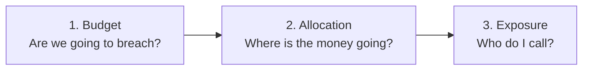

# Part 3 - Pick Your Three Charts

> Three charts, the criteria used to pick them, and the ones I deliberately cut. The cut list is the part that shows judgement, so it is not an appendix.

---

## The selection criteria, stated before the picks

A chart earns one of three slots only if it passes all four tests:

1. **Distinct question.** It answers something the other two do not. Two charts that answer the same question are one chart and one decoration.
2. **Ten-second legibility for a non-technical reader.** A CFO glances at it in a review meeting. If it needs a legend lecture, it fails.
3. **Maps to an action.** After reading it, the reader knows what to do or who to call. A chart that only produces "interesting" is a chart that produces nothing.
4. **The data is honestly available.** No chart that requires precision the sources in [Part 2](part2-data-sources.md) cannot deliver. A beautiful chart built on `inferred` data presented as fact is worse than no chart.

The three that survive form a deliberate narrative arc, in this order:



Sequence matters as much as selection. A CFO cannot care about shadow AI in Marketing until she knows whether the total is a problem. Leading with the governance chart would be leading with the answer to a question she has not asked yet.

---

## Chart 1 - Budget burn-up with forecast

**Question answered:** are we going to breach the limit, and how much time do I have?

**Form:** cumulative month-to-date spend as a solid line or area, the monthly limit as a flat reference line, a dashed projection from today to month-end, and the projected overage shaded between the projection and the limit.

```
$140K │                                                    ╭─── forecast $134.2K
      │                                                ╭───╯   ▒▒▒ overage $14.2K
$120K ├─ ─ ─ ─ ─ ─ ─ ─ ─ ─ ─ ─ ─ ─ ─ ─ ─ ─ ─ ─ ─ ─╭───╯▒▒▒▒▒▒▒▒▒▒  limit
      │                                      ╭────╯
      │                          ╭───────────╯  ← today (day 19)
 $60K │              ╭───────────╯
      │      ╭───────╯     actual, metered
      │ ╭────╯
   $0 └──┴────┴────┴────┴────┴────┴────┴────┴────┴────┴────┴────
        1    4    7   10   13   16   19   22   25   28   31

  "On current pace, August closes $14.2K (12%) over the $120K limit."
```

**Why this one gets the first slot.** Budget versus actual versus forecast is the native mental model of the person reading this screen. She already thinks in it for headcount, marketing and cloud; presenting AI spend the same way means there is nothing to learn. More importantly, **it is the only one of the three charts that is predictive**, and prediction is what converts a report into a decision. Knowing on 19 August that the month closes 12% over is actionable. Learning on 1 September that it closed 12% over is an incident report.

**Why not the obvious alternatives:**

- **A gauge or donut showing "78% of budget used."** Encodes position without trajectory, which is the half that matters. 78% on day 12 and 78% on day 28 are opposite situations and a gauge draws them identically.
- **A single big KPI number.** Already on the screen in the tile strip. Duplicating it in the chart row wastes the most valuable real estate on the page.
- **A monthly bar chart of the last 12 months.** Good for a trend review, useless for intervening in the month you are in - it can only ever tell you about months you can no longer change.

**Honesty requirements built into the chart:** the actual line stops at the last reconciled day rather than running to today, the last 48 hours are visually distinguished because billing data gets restated, and the forecast is explicitly labelled `estimated` with its method (trailing seven-day average, seasonality-naive in v1) available on hover. A forecast presented with false precision is the fastest way to lose the reader the first time it misses.

---

## Chart 2 - Spend by tool, ranked, with limit markers and policy colouring

**Question answered:** where is the money actually going, and which tools are outside their limit or outside policy?

**Form:** horizontal bars sorted descending by month-to-date spend, top ten with the remainder collapsed into "18 others". Each bar carries a **limit marker** (a vertical tick, bullet-chart style) and colour encodes policy state: sanctioned, pending review, shadow.

```
                                    ⋮ = tool limit    ⚠ = shadow / unapproved

  GitHub Copilot   ████████████████████████▌      ⋮        $22.4K
  OpenAI API       ████████████████████▌      ⋮            $19.1K   over limit
  M365 Copilot     ████████████████⋮                       $14.8K
  Claude Team      ████████████⋮                           $11.2K
  Midjourney  ⚠    ██████████▌  ⋮                          $ 9.7K   242% of limit
  Cursor           ████████⋮                               $ 7.4K
  Perplexity  ⚠    █████▌  (no limit set)                  $ 5.1K
  Gamma AI    ⚠    ██▌     (no limit set)                  $ 2.2K
  Notion AI        █▌⋮                                     $ 1.4K
  18 others        ████▌                                   $ 4.3K

  "3 of the top 10 tools are over their limit; 3 were never approved."
```

**Why this one gets the second slot.** It answers the immediate follow-up question to Chart 1 - "over on *what*?" - and it does two jobs in one mark. The bar length gives allocation; the marker gives compliance. A reader gets ranking, magnitude, limit breach and policy status in a single glance, without a second chart or a tab switch.

The bullet-chart pattern is the specific reason this works. Showing spend and limit as two separate charts forces the reader to hold one image in memory while reading the other, which is exactly the cognitive load a ten-second chart cannot afford.

**Why not the obvious alternatives:**

- **Pie or donut of tool share.** Fails on three counts: unreadable past about six slices and a real org has twenty-plus tools; humans compare angles badly; and critically, **a pie cannot express a limit at all**, so it drops half of what this dashboard exists to communicate. It also implies the whole is fixed and the question is only how to divide it, which is the wrong frame for a spend-control product.
- **Treemap.** Attractive, and genuinely worse at the job. Area comparison is less precise than length, ranking is not readable, long tool names do not fit, and it has nowhere to put a limit marker.
- **Vertical bars.** Tool names like "Microsoft 365 Copilot" and "GitHub Copilot Enterprise" become rotated, truncated labels. Horizontal costs nothing and reads better.
- **Grouped bars of spend next to limit.** Doubles the number of marks and halves the readability for information the marker already carries.

**Detail that matters:** the "no limit set" tools appear with an explicit annotation rather than an empty space. An absent limit is a governance gap and should read as one, not as a rendering artefact.

---

## Chart 3 - Sanctioned vs. pending vs. shadow spend by department

**Question answered:** who is spending on tools nobody approved, and therefore who do I call?

**Form:** stacked horizontal bars, one per department, segmented into sanctioned / pending review / shadow, **sorted by shadow dollars descending** rather than by total. A permanent `Unattributed` row sits at the bottom.

```
                █ sanctioned    ░ pending review    ▓ shadow

  Marketing     ██████████░░░░░░▓▓▓▓▓▓▓▓        $21.4K   shadow $6.8K  ← worst
  Engineering   ████████████████████░░░░▓▓▓▓    $38.2K   shadow $4.1K
  Design        ████████░░▓▓▓▓                  $12.1K   shadow $2.2K
  Sales         ███████▓▓                       $ 9.8K   shadow $1.1K
  Product       ██████░░                        $ 8.4K   shadow    -
  Support       █████░░                         $ 6.2K   shadow    -
  Unattributed  ███▓▓▓▓▓                        $ 5.9K   ⚠ cannot allocate

  "Marketing has $6.8K of unapproved AI spend this month, the highest of any
   department. 3 tools, 1 with no DPA. Owner: VP Marketing."
```

**Why this one gets the third slot, and why the sort order is the whole design.** This is the only chart of the three that produces a **conversation with a named human**. Charts 1 and 2 produce numbers; this one produces "call the VP of Marketing." Governance work only happens when a finding has an owner, so the chart is sorted by the thing that needs owning rather than by size. Engineering spends nearly twice as much in total, and Marketing is the correct top row, because the question is exposure and not volume.

It also serves the secondary persona without a separate view. Dan reads the same bars as a risk-prioritisation queue while Priya reads them as an accountability list.

**Why not the obvious alternatives:**

- **Department-by-tool heatmap.** My strongest competing candidate, and it loses on legibility. A 8×27 grid of coloured cells is dense, requires a colour-scale legend, and asks an executive to decode saturation. It is a genuinely better *drill-down* - it is what should open when a department row is clicked - but it is the wrong executive view. Choosing the less sophisticated chart for the primary slot is the right call when the primary reader has ten seconds.
- **A count of shadow tools per department.** Loses the dollars, and dollars are what make the CFO's ask land. "Marketing has 3 unapproved tools" is a nag; "Marketing has $6.8K of unapproved spend" is a budget conversation.
- **Total spend by department without the policy split.** Answers a question nobody on this screen is asking. Departmental cost allocation is a chargeback view, and chargeback is explicitly out of scope for v1.
- **100% stacked (share of spend that is shadow).** Tempting, and it distorts: a small department with $600 of spend that is 90% shadow would dominate the chart over a real $6.8K problem. Absolute dollars with a shadow-sorted order keeps the ranking honest.

**The `Unattributed` row is deliberate and non-negotiable.** When entity resolution cannot map spend to a department, it appears here rather than being dropped or guessed. It makes the chart slightly uglier and the product considerably more trustworthy, and it doubles as a visible prompt to connect the missing source.

---

## Charts I rejected, and why

Naming the near-misses is the point of this section - a shortlist of three is only meaningful relative to what it beat.

**Idle seat waste - paid seats vs. active seats by tool.**
The one that hurt to cut, and the first chart I would add as a fourth. It is the clearest money-recovery story in the whole product: "you are paying for 478 seats nobody has touched in 30 days, worth $11.4K a month." It lost the third slot on a strict reading of the brief, which asks for usage and spend-*limit* information, and idle seats are a waste story rather than a limit story. It is not lost from the screen - it lives in the KPI strip as a headline number in [Part 1](part1-screen-spec.md) - it just does not earn one of three chart slots. If a customer told me their primary goal was cost reduction rather than governance, I would swap it in for Chart 3 that same day.

**Token or API-call volume over time.**
An engineering metric wearing a finance chart's clothes. A CFO cannot act on a token count: it does not translate to dollars at a fixed rate, it moves for reasons unrelated to decisions she can make, and the honest response to it is "so?". It belongs on a platform-team dashboard.

**Top users leaderboard.**
Rejected on product-strategy grounds, not aesthetic ones. It reframes the product from cost governance to employee surveillance, which is the specific perception that stops this category from being deployable - see the optics discussion in [Part 2](part2-data-sources.md#access-privacy-and-optics). It is also perverse: the top user of an approved AI tool is usually the person proving its value, and a chart that puts a target on them makes the company worse at AI adoption while pretending to make it more governed. Individual data exists in the product for legitimate governance queries; it does not get a chart on the executive screen.

**Sankey of data flows from departments to AI vendors.**
The best demo chart in the category and close to useless in a monthly review. It looks like insight, takes thirty seconds to parse, and after parsing it tells you what Chart 3 told you in ten.

**Model mix (spend by GPT-4 vs. Claude vs. Gemini).**
Interesting to a platform team optimising unit economics. Irrelevant to the buyer, who does not care which model was used, only what was spent and whether it was approved.

**Month-over-month spend growth rate.**
Redundant once Chart 1 has a forecast, and noisy at small denominators - a tool going from $200 to $600 shows as +200% and outranks a real problem.

**Risk-score radar or spider chart.**
Composite risk scores hide their inputs, and a governance number a CFO cannot decompose is a number she will not repeat to a board. The action table's explicit risk badges - no DPA, trains on data, not behind SSO - communicate the same thing in a form that survives the question "why?".

---

## One cross-cutting decision: every chart carries a sentence

Each of the three renders a generated plain-language takeaway beneath it, and those sentences are quoted in the mock-ups above rather than added as an afterthought.

Charts are a compression format for people who are fluent in charts. The stakeholder this dashboard is built for is fluent in money. The sentence costs almost nothing to build - it is a template over numbers the chart already has - and it means the screen still works when it is screenshotted into an email, pasted into a board deck, or read on a phone between meetings, which is where these numbers actually get consumed.
